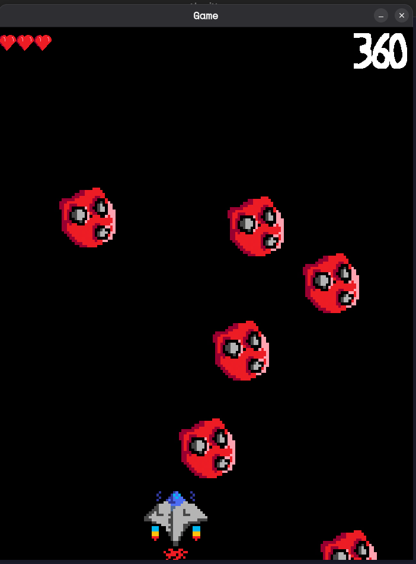
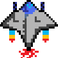
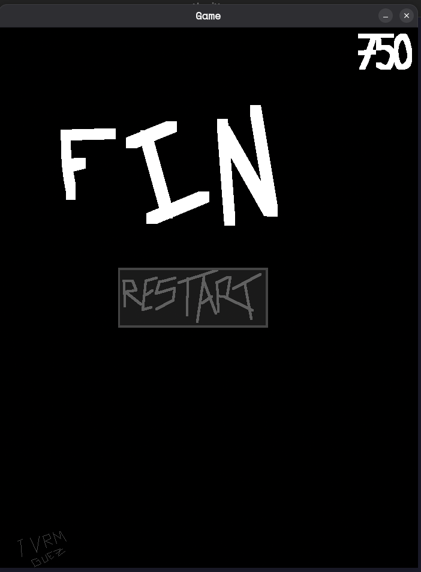
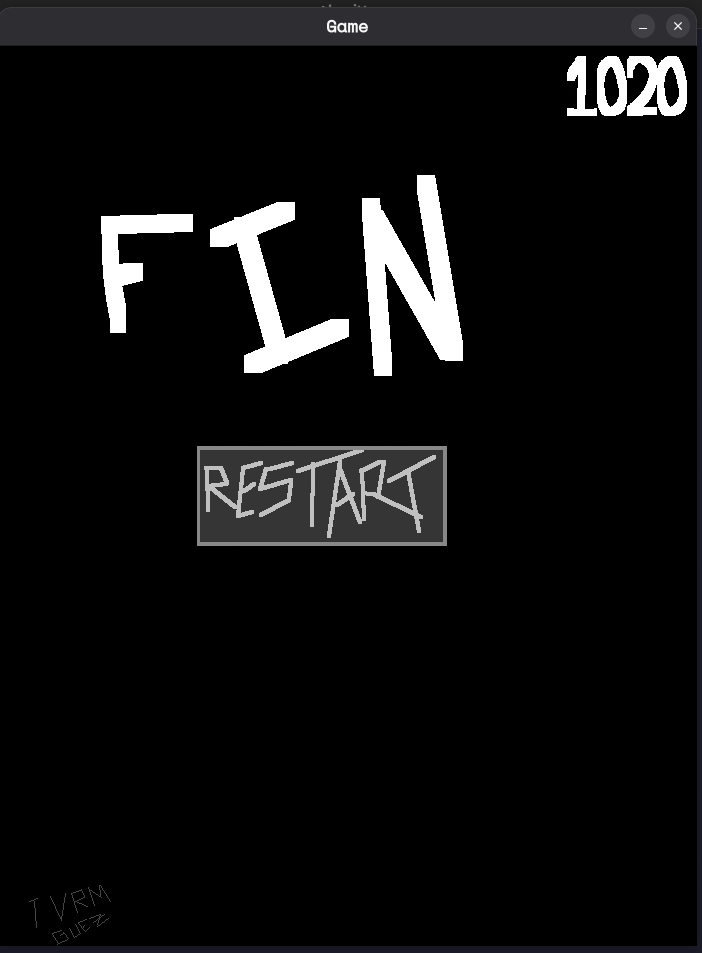

# Coulang

**Authors:**

- [Sam5429](https://github.com/Sam5429)
- [ArthurPV](https://github.com/ArthurPV)

[Blog](./BLOG.md)

---

## Requirement

Only work on Linux x86_64
You need the `raylib` and `ninja` installed
We expect you to have the libc in the `/lib`, `/usr/lib` or `/lib/x86_64-linux-gnu`

---

## Build

Go in the root of our project and execute this :

```bash
make build
ninja -C build/
./build/coulang game/game.cl
```

---

## Welcome to **ship.cool**

Welcome to **ship.cool**, a super game where _you_ are the hero! If you think we spent ages crafting an Oscar-worthy scenario, you’re wrong—we didn’t even have time to shower during this hellish week.

But hey, here’s a peek into our universe and our cool game. Enjoy!

---

### The Game



The goal? **Score as many points as possible!** To do this, you need to hit the **Cooloids** with **Coolckets**. Each hit is worth **10 points**.

> **Important:** The game offers an immersive experience in the coolest world, so **turn up your speakers** and get comfy. All game assets (audio and images) were made by us, so please be gentle.

---

#### The Cooloid


The color indicates their HP level:

- **3 HP = Red**
- **2 HP = Yellow**
- **1 HP = Green**

They’re not fast, but **don’t break too many of them**—they’ll get angry and attack you faster until you eventually die.

---

#### The Coolckets


There are two types of Coolckets:

- **Red Coolcket:** Deals less damage, but **10 points per hit** (30 points per Cooloid).
- **Blue Coolcket:** Deals more damage, but still **10 points per hit** (10 points per Cooloid).

---

#### The Coolship



The Coolship must **avoid Cooloids** by hitting them or dodging if they get too close. **Be careful!** Even if they pass by, they can still damage you. The Coolship has 3 lives. Lose them all, and it’s game over.

---

#### The Survival Kit


Has a chance to spawn when a Cooloid is destroyed. It restores one health point.

---

### Controls

- **Right arrow:** Move right _(wth dude no way !)_
- **Left arrow:** Move left
- **Up arrow:** Shoot blue Coolckets (the powerful ones)\*
- **Space bar:** Shoot red Coolckets  _(the normal ones)_

Now, try to **beat our records**:

- **Sam5429:** 
- **ArthurPV:** 740 points 

---

### The Language


As mentioned in the blog, **only the craziest among you** will dare to venture into this section.
